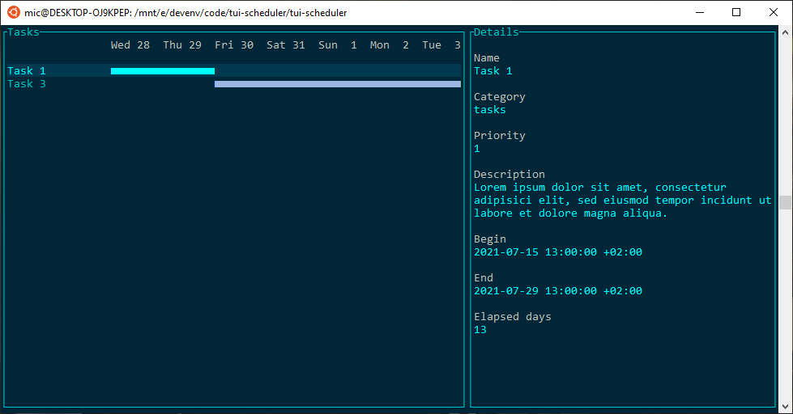

# tui-scheduler

(Very) minimalistic TUI task scheduler

The application reads a series of user-defined tasks from a JSON file, filters them by date and shows the relevant entries in a command line interface. 
The Rust [tui-rs](https://github.com/fdehau/tui-rs) library is used for the text interface. The initial development was based
on the rust-tui tutorial found here: [rust-and-tui-building-a-command-line-interface-in-rust](https://blog.logrocket.com/rust-and-tui-building-a-command-line-interface-in-rust).
The color scheme was inspired by the [Spotify TUI](https://github.com/Rigellute/spotify-tui).





The application expects a JSON file named 'tasks.json' file in the $HOME directory.
Its structure needs to be as follows:

```json
[
	{
		"name": "Task 1",
		"category": "tasks",
		"description": "Lorem ipsum dolor sit amet, consectetur adipisici elit, sed eiusmod tempor incidunt ut labore et dolore magna aliqua. Ut enim ad minim veniam, quis nostrud exercitation ullamco laboris nisi ut aliquid ex ea commodi consequat. Quis aute iure reprehenderit in voluptate velit esse cillum dolore eu fugiat nulla pariatur. Excepteur sint obcaecat cupiditat non proident, sunt in culpa qui officia deserunt mollit anim id est laborum.",
		"priority": 1,
		"begin": "2019-01-01T11:00:00Z",
		"end": "2021-07-29T11:00:00Z"
	},
	{
		"name": "Task 2",
		"category": "tasks",
		"description": "",
		"priority": 2,
		"begin": "2016-01-01T11:00:00Z",
		"end": "2018-01-01T11:00:00Z"
	},
	{
		"name": "Task 3",
		"category": "tasks",
		"description": "",
		"priority": 2,
		"begin": "2021-07-30T11:00:00Z",
		"end": "2022-01-01T11:00:00Z"
	}
]
```


